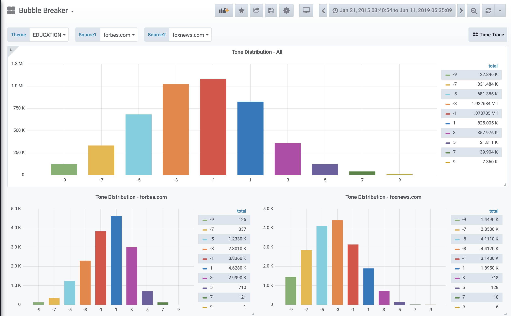
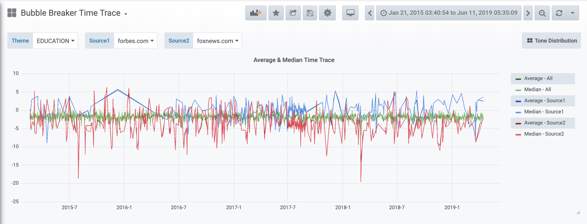

# Bubble Breaker
> ***Break filter bubbles by gaining diverse perspectives on global news***

This project is completed as part of the Insight Data Engineering program (New York, Summer 2019).
Visit [big-data-compute.com](https://big-data-compute.com) to see the interactive webpage.

# Introduction

Social tribalism is a problem in this age of social media. The first step towards breaking the "filter bubble" is by recognizing the existence of the bubble, and that there is not a single view but a spectrum of views of things. To help break the bubble, this project provides users with a frontend to query selected popular new topics, and access the sentiments surrounding this topic from a variety of news source. This grants users awareness of the full spectrum of views, and brings the time evolution of such sentiments to the user for a deeper understanding and potential future studies.






# Project Structure
```
.
├── README.md
├── data
│   ├── list-of-tax-2018.csv
│   ├── list-of-top-src-2018.csv
│   ├── list-of-top-themes-2015to9-1000.csv
│   └── list-of-top-themes-2015to9-500.csv
├── db
│   ├── bubblebreaker.sql
│   └── bubblebreaker_src.sql
├── images
│   ├── bubble-breaker-pipeline.png
│   ├── tone-distribution.png
│   └── tone-evolution.png
├── run.sh
└── src
    └── spark
        ├── compute-analytics-top-cleaned-themes-daily-with-src.py
        ├── db_properties.ini
        ├── db_properties_src.ini
        ├── functions.py
        ├── get-src-list.py
        ├── get-taxonomy-list.py
        ├── get-top-themes.py
        ├── legacy
        │   ├── compute-analytics-top-cleaned-themes.py
        │   └── compute-avg-tone-per-theme.py
        ├── run-generate-list.sh
        ├── run-generate-tax.sh
        └── run.sh

```

# Data
The Global Database of Events, Language, and Tone (GDELT) dataset gathers news reports from all over the globe, and identifies the people, locations, organizations, themes, sources, emotions, counts, quotes, images and events involved. The dataset amounts to ~1.3TB per year, and is updated every 15 minute. The sentiment scores, or "tones", in this project are obtained entirely from GDELT's sentiment analyses on new texts.


# Data Pipeline


# TimescaleDB
Since the news data is naturally timestamped, it makes sense to query the data in a time-oriented fashion. I chose TimescaleDB to store batch-processed data because it provides time-partitioning for faster data ingestion and query, as well as time-oriented features. Since TimescaleDB is built as an extension on top of PostgreSQL, it also comes with the familiar SQL language and supports. TimescaleDB is also open-source and free.

To set up a TimescaleDB database, follow the instructions on https://www.timescale.com. The schema files used can be found in `db`. For bubble-breaker, you can create two tables on a machine where PostgreSQL is installed by (assuming the username of PostgreSQL is 'postgres')

`sudo psql -U postgres -d bubblebreaker -a -f bubblebreaker.sql` 

`sudo psql -U postgres -d bubblebreaker -a -f bubblebreaker_src.sql` 


# Job Preparation

## Theme Cleaning
New themes in GDELT are encoded in a specific taxonomy. A complete record of this taxonomy has yet to be found by me. For example, the theme 'CLIMATE_CHANGE' is encoded as
> WB_567_CLIMATE_CHANGE

The taxonomy words do not help a human reader reading the theme, generally speaking. To clean the taxonomy words that appear as prefixes, one needs to first determine the list of taxononmy words. I do this by performing a word counr of the first two words in a theme split by `'_'`, as the prefixes always appear within the first two words of the encoded theme. The reverse is not true. That is, the first two words in an encoded theme are not always taxonomy words. After the word count, if the count of a word is equal to or above a preset threshold, it is considered a taxonomy word and added to a list recording all known taxonomy words. Currently the default list is generated with 2018 data in a batch job. The threshold is set at 10.

Once such taxonomy list is constructed, it is used in the cleaning of the themes.

## Most frequent themes and news sources
To limit the query list to a reasonable length, I picked the most frequent (cleaned) themes and news sources. They are the top 500 themes using 2015-2019, and top 100 news sources using 2018 data.

# Running Bubble-Breaker
The event data is extracted from S3 datasource and cleaned according to the prescription above. The data is transformed to perform calculation of tone score analytics and loaded to TimescaleDB. The Grafana web layer servers the analytics to display the database contents.

## Starting Batch Job
To run bubble-breaker using the default/existing taxonomy, theme, news source lists, do 

`./run.sh --existing`

To run while regenerating the above lists, do 

`./run.sh --new`

## Grafana
To start a Grafana server, download Grafana from https://grafana.com/, and follow instructions to set up the server. To link to the TimescaleDB database, access Grafana server dashboard and follow Grafana instruction to link to the database (choose PostgreSQL), and use the query editor to create data visualization panels.
